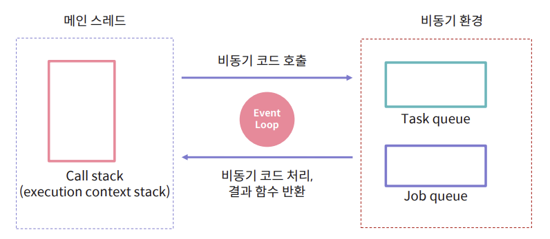

# 제어 흐름(동기,비동기) / 이벤트 루프 / Promise

자바스크립트는 다른 멀티스레드 프로그래밍 언어와 다른 방식으로 비동기 동작을 처리한다.

## 자바스크립트 엔진

- 자바스크립트 엔진은 하나의 메인 스레드로 이루어져 있다.
- 메인 스레드는 코드를 한 줄씩 실행한다.
- 브라우저 환경에서는 유저 이벤트를 처리하고 화면을 그린다.

## 동기적 제어 흐름

- 현재 실행 중인 코드가 종료되기 전까지 다음 줄의 코드를 실행하지 않는 것
- 분기문, 반복문, 함수 호출
- 코드의 흐름 = 실제 제어 흐름
- 싱글 스레드 환경에서 메인 스레드를 긴 시간 점유하면 프로그램을 멈추게 한다.

```jsx
let a = 10;
console.log("a: ", a);

function foo(num) {
  for (let i = 0; i < 10; i++) {
    console.log(num);
  }
}

foo(a);
```

## 비동기적 제어 흐름

- 현재 실행 중인 코드가 종료되기 전에 다음 라인의 코드를 실행하는 것
- promise, callback 함수를 호출하는 함수
- 코드 흐름 ≠ 실제 제어 흐름
- 비동기 작업을 기다리는 동안 메인 스레드는 다른 작업을 처리한다.

```jsx
let a = 10;

setTimeout(function callback() {
  console.log("a: ", a);
}, 3000);

console.log("Finished");
```


# 이벤트 루프 (Event Loop)

## 자바스크립트 비동기

- 자바스크립트 엔진은 비동기 처리를 제공하지 않는다.
- 대신 비동기 코드는 정해진 함수를 통해 활용할 수 있다.
- setTimeout, XMLHttpRequest, fetch ...
- node.js → 파일 처리 API, 암호화 API

자바스크립트의 큰 특징 중 하나는 '단일 스레드' 기반의 언어라는 점이다.

곧, 동시에 하나의 작업만을 처리할 수 있다라는 말이다.

하지만 실제로 자바스크립트가 사용되는 환경을 생각해보면 많은 작업이 동시에 처리되고 있는 걸 볼 수 있다.

**자바스크립트는 어떻게 동시성(Concurrency)을 지원하는 걸까?**

## 이벤트 루프

자바스크립트는 이벤트 루프를 이용해서 비동기 방식으로 동시성을 지원한다.



- 비동기 코드를 처리하는 모듈은 자바스크립트 엔진 외부에 있다.
- 이벤트 루프, 태스크 큐, 잡 큐 등으로 구성된다.
- API 모듈은 비동기 요청을 처리 후 태스크 큐에 콜백 함수를 넣는다.
- 자바스크립트 엔진은 콜 스택이 비워지면 태스크 큐의 콜백 함수를 실행한다.

# Promise

태스크 큐가 아닌 잡 큐를 사용하는 비동기 API

잡 큐는 태스크 큐보다 우선순위가 높다.

```jsx
setTimeout(() => {
  console.log("타임아웃 1");
}, 0);

Promise.resolve().then(() => console.log("프로미스 1"));

setTimeout(() => {
  console.log("타임아웃 2");
}, 0);

Promise.resolve().then(() => console.log("프로미스 2"));
// 프로미스 1 프로미스 2
// 타임아웃 1 타임아웃 2
```

## Promise 단계

비동기 작업의 진행, 성공, 실패 상태를 표현한다.

- 성공: pending → fulfilled (resolved)
  - then
- 실패: pending → rejected
  - catch

fulfilled, rejected를 합쳐서 settled라고도 함.

## Promise 생성자

```jsx
let promise = new Promise((resolve, reject) => {
  if (Math.random() < 0.5) {
    return reject("실패");
  }
  resolve(10);
});
```

## Promise 메서드 체인

```jsx
promise
  .then(data => {
    console.log("성공: ", data);
  })
  .catch(e => {
    console.log("실패 : ", e);
  })
  .finally(() => {
    console.log("promise 종료");
  });
```

then → 성공

catch → 실패

finally → 성공, 실패 상관 없이 실행

## Promise.resolve, Promise.reject

```jsx
Promise.resolve(10).then(console.log);
Promise.reject("Error").catch(console.log);
```

Promise.resolve → 성공한 promise 바로 반환

Promise.reject → 실패한 Promise 바로 반환

## Promise.all

```jsx
Promise.all([promise1, promise2, promise3])
  .then(values => {
    console.log("모두 성공 : ", values);
  })
  .catch(e => {
    console.log("하나라도 실패 : ", e);
  });
```

- Promise의 배열을 받아 모두 성공 시 각 Promise의 resolved 값을 배
  열로 반환한다.
- 하나의 Promise라도 실패할 시, 가장 먼저 실패한 Promise의 실패 이유를 반환한다.
