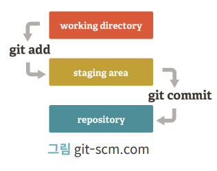
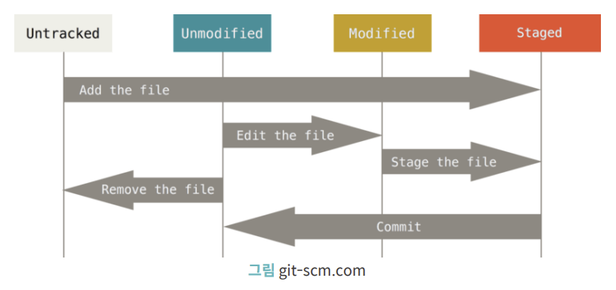
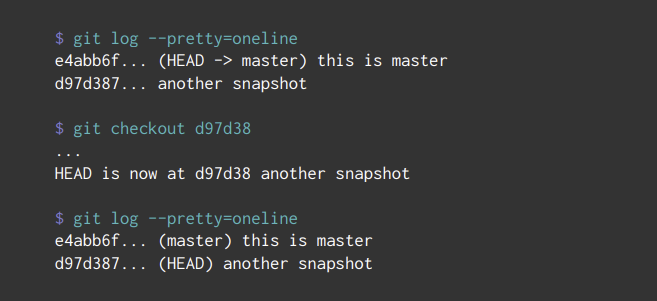

# Git

`git add` : working directory → staging area

`git commit` : staging area → repository

## 파일의 라이프 사이클

## 사용자 정보 설정

`git config --global user.name "name"` 유저 네임 설정

`git config --global user.email gitaccount@email.com` 유저 이메일 설정

- 프로젝트마다 다른 사용자 정보를 사용할 땐 `--global` 제외

`git config --list` : 설정 정보 확인

## 저장소 생성

`git init`

## 파일을 준비 영역으로 보내기

`git add [파일명.확장자]`

`git add .` 모든 파일을 add

## Git 저장소 반영

`git commit -m "커밋 메시지"`

## 커밋 메시지 수정

`git commit --amend`

→ 텍스트 편집기 실행 → 수정 후 저장

## Git 관리 상태 확인

`git log` git history 확인

- `git log -p -2`
  - `-p`, `--patch` : `diff` 와 같은 역할
  - `-n` : 상위 n개의 commit만 보여줌
- `git log --stat` 어떤 파일이 commit에서 수정되고 변경되었는지, 파일 내 라인이 추가되거나 삭제되었는지 확인
- `git log --pretty=oneline` : 각 commit을 한 줄로 출력
- `git log --graph`: commit간의 연결 관계를 그래프로 출력
- `git log -S [특정 텍스트]` : 코드에서 추가되거나 제거된 내용 중 특정 텍스트가 포함되어 있는지 검사

`git status` staging file 상태 확인

- untracked: add 되지 않은 파일
- modified: commit 된 파일 중 수정된 파일이 있을 경우

`git reset [file_name]` add 명령 취소

`git diff` commit 된 파일 중 변경된 사항을 비교할 때

## Git 브랜치

`git branch [브랜치 이름]` 브랜치 생성

`git branch` 브랜치 조회

`git checkout [브랜치 이름]` 브랜치 전환

`git checkout [snapshot hash]` 스냅샷 넘나들기

`git branch -d [브랜치 이름]` 브랜치 삭제

## Git Merge

`git checkout master` 마스터 브랜치로 이동 후

`git merge [브랜치 이름]` 브랜치 병합

⇒ 브랜치의 내용이 마스터 브랜치로 업데이트

`git branch --merged` merge된 브랜치 확인

## Git 원격 저장소

`git clone [repository 주소]` 기존의 git repository 복사

`git remote add [이름] [repository 주소]` [이름]으로 원격저장소 추가

`git remote` 원격 저장소 확인

`git remote show [이름]` 원격 저장소 정보 살펴보기

`git remote rename [원래 이름] [변경할 이름]` 원격 저장소 이름 변경

`git remote rm [이름]` 원격 저장소 삭제

`git pull [원격 저장소 이름] [받아오고자 하는 브랜치]` 원격 저장소 데이터를 로컬 데이터와 병합

`git fetch` 원격 저장소 데이터를 가져오지만 병합하지는 않음

- `git log` 로 변경된 파일을 확인하고 merge 해야함
  - `git fetch origin/master`

`git push [원격 저장소 이름] [브랜치 이름]` 저장소 발행

## HEAD를 이용한 버젼 관리

`git reset --soft HEAD~` HEAD를 전의 snapshot으로 이동

`git reset --hard HEAD~` HEAD를 전의 snapshot으로 이동하고 파일도 삭제

## git rebase

[https://velog.io/@kwonh/Git-Rebase란](https://velog.io/@kwonh/Git-Rebase%EB%9E%80)
